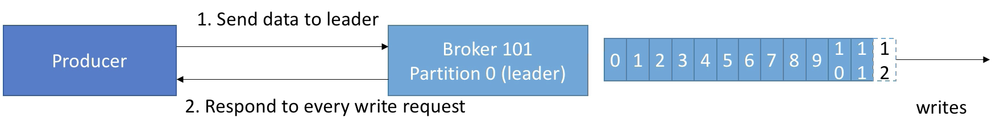
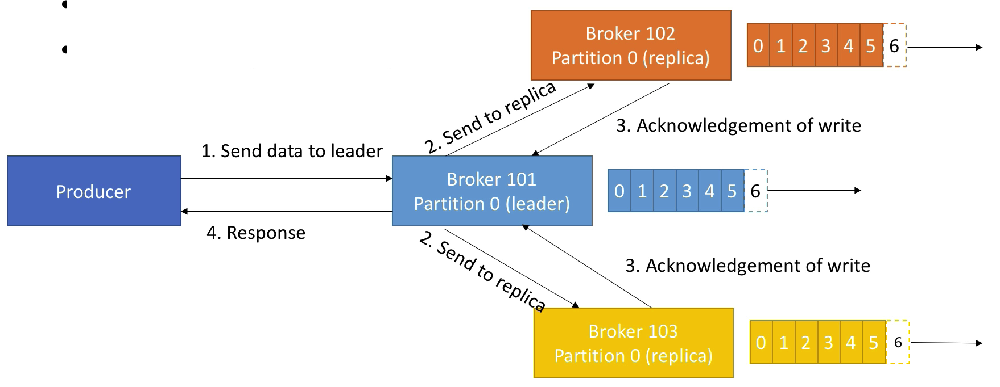
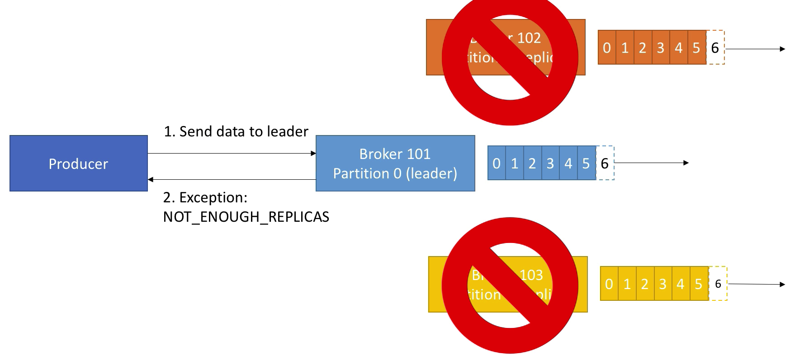
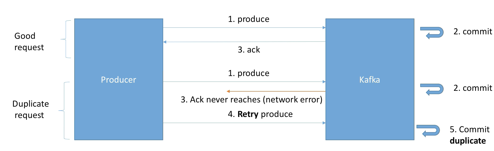
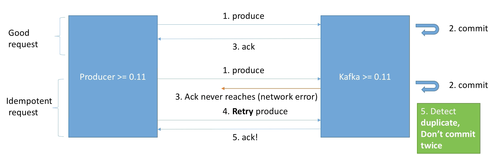
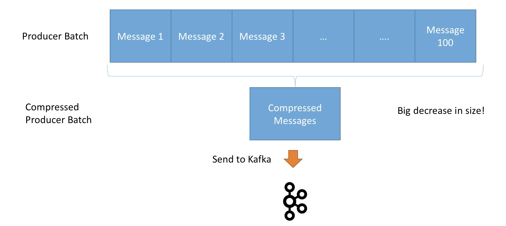
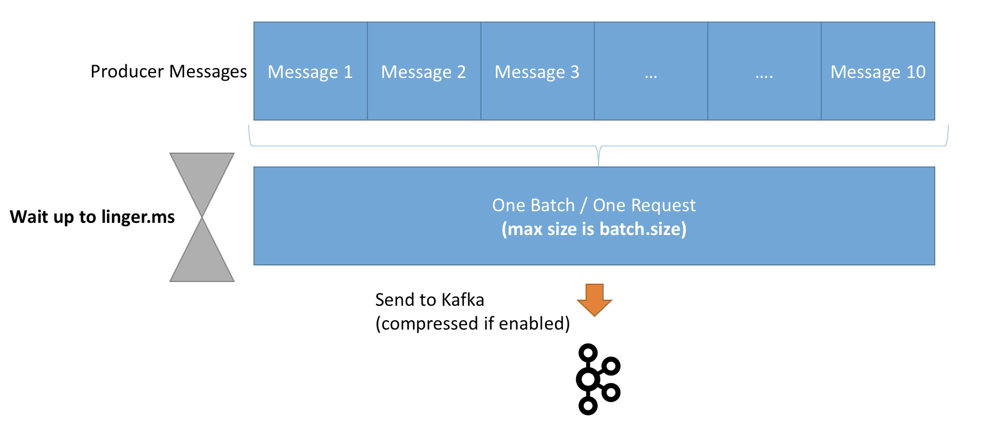

# Udemy

Course link - https://www.udemy.com/course/apache-kafka

# Use Cases

* Messaging System
* Activity Tracking
* Gather metrics from many different locations
* Applications logs gathering
* Stream processing (with Kafka Streams API or Spark for example)
* De-coupling of system dependencies
* Integration with Spark, Flink, Storm, Hadoop, and many other Big Data technologies

# Topics, partitions and offsets

## Topics

A particular stream of data

* Similar to a table in a database (without all the constraints)
* You can have as many topics as you want
* A topic is identified by its name

Topics are split in <u>partitions</u>

## Partitions

Each partitions is ordered

Each message within a partition gets an incremental id, called <u>offset</u>

Number of partitions are set during creation of a topic

Offset only have a meaning for a specific partition (offset 3 in partition 0 doesn't repserent the same data as offset 3 in partition 1)

Order is guaranteed only within a partition (not across partitions)

Data is kept only for a limited time (default is one week)

One the data is written to a partition, i can't be changed (immutability)

Data is assigned randomly to a partition unless a key is provided 

# Brokers

A Kafka cluster is composed of multple brokers (servers)

Each broker is identified with its ID

Each broker contains certain topic partitions

After connecting to any broker (called a bootstrap broker), you will be connected to the entire cluster

A good number to get started is 3 brokers, but some big clusters have over 100 brokers

In these example we choose to number brokers starting at 100 (arbitrary)

# Topic replication factor

Topics should have a replication factor > 1 (usually between 2 and 3 - 3 is gold standart)

This way if a broker is down, another broker can serve the data

**<u>At any time only ONE broker can be a leader for a given partition</u>**

<u>**Only that leader can receive and serve data for a partition**</u>

The order brokers will synchronise the data

Therefore each partition has one leader and multiple ISR (in-sync replica)

# Producers

Producers write data to topics (which is made of partitions)

Producers automatically know to which broker and partition to write to

In case of Broker failures, Producers will automatically recover

Producers can choose to receive acknowledgment of data writes:

* <u>acks=0</u> - Producer won't wait for acknowledgment (possible data loss)
* acks=1 - Producer will wait for leader acknowledgment (limited data loss)
* acks=all - Leader + replicas acknowledgment (no data loss)

## Message keys

Producers can choose to send a key with the message. Message can be string, number, etc.

If key=null, data is sent round robin (first broker then second broker then third broker... )

If a key is sent, then all messages for that key will always go to the same partition

A key is basically sent if you need message ordering for a specific field. This guarantee thanks to key hashing, which depends on the number of partitions.

## Acks Deep Dive

### acks=0 (no acks)

No response is requested

If the broker goes offline or an exception happens, we won't know and will lose data

Useful for data where it's okay to potentially lose messages

### acks=1 (leader acks)

Leader response is requested, but replication is not a guarantee (happens in the background)

If an ack is not received, the producer may retry



If the leader broker goes offline but replicas haven't replicated the data yet, we have a data loss

### acks=all (replicas acks)

Leader + Replicas ack requested

Added <u>latency</u> and <u>safety</u>

No data loss if enough replicas

acks=all must be used in conjuction with **min.insync.replicas**

**min.insync.replicas** can be set at the broker or topic level (override).

**min.insync.replicas=2** implies that at least 2 brokers that are ISR (including leader) must respond that they have the data

That means if you use **replication.factor=3**, **min.insync=2**, **acks=all**, you can only tolerate **1** broker going down, otherwise the producer will receive an exception on send.



In case of **min.insync.replicas=2**



## Producer Retries

In case of transient failures, developers are expected to handle exceptions, otherwise the data will be lost.

Example of transient failure:

* NotEnoughReplicasException

There is a **retries** setting

* defaults to 0 for Kafka <= 2.0
* defaults to 2147483647 for Kafka >= 2.1

The **retry.backoff.ms** setting is by default 100 ms

### Producer timeouts

If retries > 0, for example retries = 2147483647

the producer won't try the request for ever, it's bounded by a timeout.

For this, you can set an intuitive Producer Timeout (KIP-91 - Kafka 2.1)

**delivery.timeout.ms** = 120000 ms == 2 minutes

Records will be failed if they can't be acknowledged in delivery.timeout.ms

### Warning

In case of retries, there is a chance that messages will be sent out of order (if a batch has failed to be sent).

**If you rely on key-based ordering, that can be an issue.**

For this, you can set the setting while controls how many produce requests can be made in parallel: **max.in.flight.requests.per.connection**

* default - 5
* Set it to 1 if you beed to ensure ordering (may impact throughput)

In Kafka => 1.0.0, there is a better solution with idempotent producers!

## Idempotent Producer

Here is the problem: the Producer can introduce duplicate messages in Kafka due to network errors



In Kafka >= 0.11m you can define a "idempotent producer" which won't introduce on network error



Idempotent producers are great to guarantee a stable and safe pipeline!

They come with:

* retries = Integer.MAX_VALUE(2^31-1 = 2147483647)
* max.in.flight.request=1 (Kafka == 0.11) or
* max.in.flight.request=5 (Kafka >= 1.0 - higher performance & keep ordering)
  * See https://issues.apache.org/jira/browse/KAFKA-5494
* acks=all

These settings are applied automatically after your producer has started if you don't set them manually

Just set:

**enable.indepotence=true**

## Safe producer summary

Kafka < 0.11

**acks=all** (producer level)

* Ensures data is properly replicate before an ack is received

**min.insync.replicas=2** (broker/topic level)

* Ensures two brokers in ISR at least have the data after an ack

**retries=MAX_INT** (producer level)

* Ensures transient errors are retried indefinitely 

**max.in.flight.requests.per.connection=1** (producer level)

* Ensures only one request is tried at any time, preventing message re-ordering in case of retries

Kafka >= 0.11

**enable.indepontence=true** (producer level) + **min.insync.replicas=2** (broker/topic level)

* Implies **acks=all**, **retries=MAX_INT**, **max.in.flight.requests.per.connection=1** if Kafka 0.11 or 5 if Kafka >= 1.0 while keeping ordering guarantees and improving performance!

Running a "safe producer" might impact throughput and latency, always test for your use case

## Message Compression

Producer usually send data that is text-based, for example with JSON data

In this case, it is important to apply compression to the producer

Compression is enabled at the Producer level and doesn't required any configuration change in the Brokers or in the Consumers

**compression.type** can be **none** (default), **gzip**, **lz4**, **snappy**

Compression is more effective the bigger the batch of message being sent to Kafka!

Benchmarks here: https://blog.cloudflare.com/squeezing-the-firehouse/



The compressed batch has the following advantage:

* Much smaller producer request size (compression ration up to 4x!)
* Faster to transfer data over the network => less latency
* Better throughput
* Better disk utilisation in Kafka (stored messages on disk are smaller)

Disadvantages (very minor):

* Producers must commit some CPU cycles to compression
* Consumers must commit some CPU cycles to decompression

Overall:

* Consider testing snappy or lz4 for optimal speed / compression ratio

## Producer Batching

By default, Kafka tries to send records as soon as possible

* It will have up to 5 request in flight, meaning up to 5 messages individually sent at the same time.
* After this, if more messages have to be sent while others are in flight, Kafka is smart and will start batching them while they wait to send them all at once.

This smart batching allow Kafka to increase throughput while maintaining very low latency

Batches have higher compression ratio so better efficiency

**linger.ms** - Number of milliseconds a producer is willing to wait before sending a batch out (default 0)

By introducing some lag (for example **linger.ms=5**), we increase the chances of messages being sent together in a batch

So at the expense of introducing a small delay, we can increase throughput, compression and efficiency of our producer.

If a batch is full (see **batch.size**) before the end of the **linger.ms** period, it will be sent to Kafka right away!



**batch.size** - Maximum number of bytes that will be included in a batch. The default is 16KB.

Increase a batch size to something like 32KB or 64KB can help increasing the compression, throughput, and efficiency of requests

Any message that is bigger than the batch size will not be batched

A batch is allocated per partition, so make sure that you don't set it to a number that's too high, otherwise you'll run waste of memory!

(Note: You can monitor the average batch size metric using Kafka Producer Metrics)

## Producer default partitioner and how keys are hashed

By default, your keys are hashed using the **murmur2** algorithm

it is most likely preferred to not override the behaviour of the partitioner, but it is possible to do so (**partitioner.class**)

The formula is:

``targetPartition = Utils.abs(Utils.murmur2(record.key())) % numPartitions;``

This means that same key will go to the same partition, and adding partitions to a topic will completely alter the formula

# Consumers

Consumers read data from a topic (identified by name)

Consumers know which broker to read from

In case of broker failures, consumers know how to recover

Data is read in order <u>**within each partitions**</u>

## Consumer Groups

Consumers read data in consumer groups

Each consumer within a group reads from exclusive partitions

If you have more consumers than partitions, some consumers will be inactive

*Note: Consumers will automatically use a GroupCoordinator and a ConsumerCoordinator to assign a consumers to a partition.*

## Consumer Offsets

Kafka stores the offsets at which a consumer group has been reading

The offsets committed live in a Kafka topic named **__consumer_offsets**

When a consumer in a group has processed data received from Kafka, it should be committing the offsets

If  a consumer dies, it will be able to read back from where it left off thanks to the committed consumer offsets!

### Delivery semantics for consumers

Consumer choose when to commit offsets 

There are 3 delivery semantics:

1. At most once:
   * offsets are committed as soon as the message is received
   * if the processing goes wrong, the message will be lost (it won't be read again)
2. At least once (usually preferred):
   * offsets are committed after the message is processed
   * if the processing goes wrong, the message will be read again
   * this can result in duplicate processing of messages. Make sure your processing is <u>idempotent</u> (i.e. processing again the messages won't impact your system)
3. Exactly once:
   * Can achieved for Kafka => Kafka workflows using Kafka Streams API
   * For Kafka => External System workflows, use a <u>idempotent</u> consumer

# Kafka Broker Discovery

Every Kafka broker is also called a "bootstrap server"

That means that **you only need to connect to one broker**, and you will be connected to the entire cluster

Each broker knows about all brokers, topics and partitions (metadata)

# Zookeeper

Zookeeper manages brokers (keeps a list of them)

Zookeeper helps in performing leader election for partition

Zookeeper sends notifications to Kafka in case of changes (e.g. new topic, broker dies, broker comes up, delete topics, etc...)

**Kafka can't work without Zookeeper**

Zookeeper by design operates with an odd number of servers (3, 5, 7)

Zookeeper has a leader (handle writes) the rest of the servers are followers (handle reads)

Zookeeper does NOT store consumer offsets with Kafka > v0.10

# Kafka Guarantees

1. Messages are appended to a topic-partition in the order they are sent
2. Consumers read messages in the order stored in a topic-partition
3. With a replication factor of N, producers and consumers can tolerate up to N-1 brokers being down
4. This is why a replication factor of 3 is a good idea
   * Allows for one broker to be taken down for maintenance
   * Allows for another broker to be taken down unexpectedly
5. As long as the number of partitions remains constant for a topic (no new partitions), the same key will always go to the same partition

# CLI

## Kafka topics

Create topic

```
kafka-topics --zookeeper 127.0.0.1:2181 --topic first_topic --create --partitions 3 --replication-factor 1
```

Show list of topics

```
 kafka-topics --zookeeper 127.0.0.1:2181 --list
```

Information about topic

```
kafka-topics --zookeeper 127.0.0.1:2181 --topic first_topic --describe
```

Delete topic, will mark topic as deleted 

```
kafka-topics --zookeeper 127.0.0.1:2181 --topic second_topic --create --partitions 6 --replication-factor 1
kafka-topics --zookeeper 127.0.0.1:2181 --topic second_topic --delete
```

## Kafka console consumer

Create consumer

```bash
kafka-console-consumer --bootstrap-server 127.0.0.1:9092 --topic first_topic
```

Create consumer from the begging

```bash
kafka-console-consumer --bootstrap-server 127.0.0.1:9092 --topic first_topic --from-beginning
```

With group

```bash
kafka-console-consumer --bootstrap-server 127.0.0.1:9092 --topic first_topic --group my-first-application
```

Consumers with the same group will split messages between this consumers, for example first_message will be received by first consumer, second_message will be received by second consumer. First consumer will not receive second_message. When you start or stop consumer they will rebalanced automatically.

If you run `kafka-console-consumer --bootstrap-server 127.0.0.1:9092 --topic first_topic --group my-second-application --from-beginning` multiple times, then on the second time you will not see any topics even if you specify **--from-beginning** it happens because of committed-offset. Because consumer with this group already read all messages, and you will receive only new messages. It will work if kafka do not contains any new messages, if it has, then consumer will receive all new messages from offset that was committed (even without --from-begenning).

## Kafka console producer

Create consumer

```bash
kafka-console-producer --broker-list 127.0.0.1:9092 --topic first_topic
```

With property acks=all

```bash
kafka-console-producer --broker-list 127.0.0.1:9092 --topic first_topic --producer-property acks=all
```

With not exists topic (new topic will be created) - Try NOT to use this feature. Because in this case topic will be created with default replication factor = 1 and partitions = 1. Default values can be changed in server.properties

```bash
kafka-console-producer --broker-list 127.0.0.1:9092 --topic new_topic
```

## Kafka consumers groups

Show all consumer groups

```bash
kafka-consumer-groups --bootstrap-server 127.0.0.1:9092 --list
```

Information about group (consumers, offsets)

```bash
kafka-consumer-groups --bootstrap-server 127.0.0.1:9092 --describe --group my-second-application
```

Resetting offsets to the begenning

```bash
kafka-consumer-groups --bootstrap-server 127.0.0.1:9092 --group my-second-application --reset-offsets --to-earliest --execute --topic first_topic
```

Resetting offsets with particular shift

```bash
kafka-consumer-groups --bootstrap-server 127.0.0.1:9092 --group my-second-application --reset-offsets --execute --topic first_topic --shift-by -2
```

This command will shift offset by two for each partition (if you have 3 partitions, then you will receive 6 messages)

# Twitter APP

Source folder - org.avlasov.kafka.twitterapp

Application start ``java -cp MyJar.jar org.avlasov.kafka.twitterapp.TwitterProducer /path/twitter-app.properties ``

**twitter-app.properties** example

```properties
twitter.oauth.consumer.key=
twitter.oauth.consumer.secret=
twitter.oauth.token=
twitter.oauth.token.secret=
bootstrap.servers=127.0.0.1:9092
key.serializer=org.apache.kafka.common.serialization.StringSerializer
value.serializer=org.apache.kafka.common.serialization.StringSerializer
twitter.search.terms=bitcoin
kafka.topic=twitter_tweets
```

For twitter.oauth, please, create an application on https://developer.twitter.com/en.html

